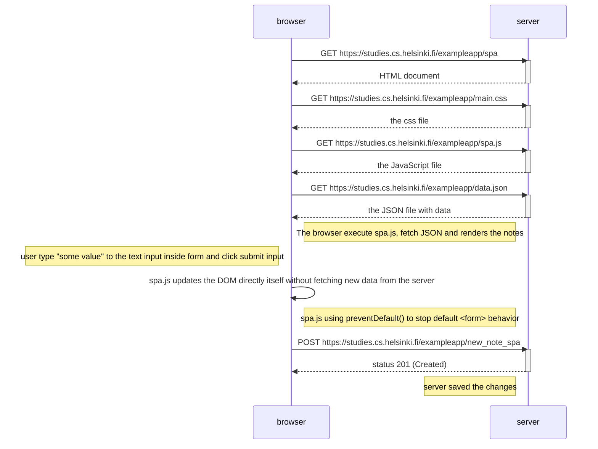

```mermaid
sequenceDiagram
    participant browser
    participant server

    browser->>server: GET https://studies.cs.helsinki.fi/exampleapp/spa
    activate server
    server-->>browser: HTML document
    deactivate server

    browser->>server: GET https://studies.cs.helsinki.fi/exampleapp/main.css
    activate server
    server-->>browser: the css file
    deactivate server

    browser->>server: GET https://studies.cs.helsinki.fi/exampleapp/spa.js
    activate server
    server-->>browser: the JavaScript file
    deactivate server

    browser->>server: GET https://studies.cs.helsinki.fi/exampleapp/data.json
    activate server
    server-->>browser: the JSON file with data
    deactivate server

    Note right of browser: The browser execute spa.js, fetch JSON and renders the notes

    Note left of browser: user type "some value" to the text input inside form and click submit input
    browser->>browser: spa.js updates the DOM directly itself without fetching new data from the server
    Note right of browser: spa.js using preventDefault() to stop default <form> behavior
    browser->>server: POST https://studies.cs.helsinki.fi/exampleapp/new_note_spa
    activate server
    server-->>browser: status 201 (Created)
    deactivate server
    Note left of server: server saved the changes
```
